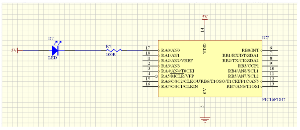
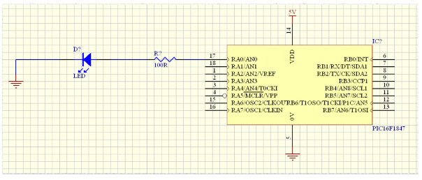

## Q1 - Two interfaces ADC sending data over TCP

This video highlight the code implementation and at the end I compile the code
in two variante MCU and SPI and runs the code in splitted CLI.
I also shows the timing of each adc channel capture.

link to the code repo: [Q1 task code](https://github.com/pslavkin/beam_trail_test/tree/main/q1)

<p align="center">
  
</p>


## Q2 - led connection options

#### vcc to led option

pros:
- in case the 5v rail that feed to the led comes from another independent regulator than the
  uC, it will not affect the uC and could be turned on and off without affecting
  the uC
- some uC has more current capabilities when switch to gnd than vcc

cons:
- the logic of the sowfware will be negated (not a big deal... but)
- when the uC is blank and before it's pin is configured, the led could draw some
  current depending on the reset state of this gpio (general HI-Z). This could
  affect some super low power applications and also could be seen in a dark
  environment
- it's more exposed to a spike in the 5v rail that could affect the uC
- when uC turn pin on it will not be exactly 5.0v, it will be less depending on
  the push-pull output impedance of the uC, so the led could draw some current
  even if the uC pin is in HI state


<p align="center">
  
</p>

#### led to gnd option

pros:
- the logic of the sowfware will be respected
- when the uC is blank and before the pin is configured, it's less common that a current draw from HI-Z pin through gnd
- when uC turn pin to LOW, there is garantee a 0.0 A current draw to the led
- when uC turn pin on it will be exactly 5.0v, so the led will draw the
- gnd is more stable than vcc, so it's less exposed to a spike in the 5v rail
  that could affect the uC
- gnd plane is everywhere, so it's easier to connect the led to gnd than to vcc

cons:
- the led will draw current from the internal uC logic and generally you have a
  total current limit summing all the pins, so if you have other pins drawing
  current, this led will decrease the total current available for the other pins

<p align="center">
  
</p>


## Q3 - Dynamic memory allocation in embedded systems

#### A 
    One of the main reasons to avoid dynamic memory allocation in embedded
    systems is that it's hard to predict the behavior of the system when the
    memory is fragmented and the system is running out of memory, or 'cause a
    memory leak. 

    In real time systems, it's important to know the maximum time that a task
    will take to execute, but with dynamic memory allocation is hard to predict
    the time that it will take to allocate memory and it's hard to predict the
    time that it will take to free memory.
    
    If you have a full static memory allocation system, you can predict the
    maximum time that a task will take to execute, avoiding real time problems,
    and never experience memory fragmentation.

    but some time the total memory of the system is less than the sum of all task
    memory requirements at compile time, so you need to share the resource using
    alloc/free memory at run-time.

    It's a good practice to use dynamic allocation only for those process that
    doesn't need real time and let static memory for the critical parts

    There is also other dynamic memory allocation strategies like grids that
    reduce some of the problems

#### B 

Is it a valid declaration on a machine which is not 16 bit?
Give an explanation. Propose proper declaration. 

```
a)    unsigned int null = 0; 
```

the declaration is valid in any arch, the 0 is guaranteed to be the same
size of the unsigned int, so if the unsigned int is 16b, the 0 will be 16b
if the unsigned int is 32b, the 0 will be 32b, and so on.

```
b)    unsigned int complement2zero_by_ones = 0xFFFF; // 1′ s complement to zero
```

1's complement to zero is obtained by inverting all the bits of the number
if the machine is not 16b, so it could be 8 or >=32b.
the unsigned int is (generally) 32b so inverting all bits of zero in a 32b
arch is 0xFFFFFFFF.
if the arch is 8b, the unsigned int could be 16b, and in that case the
original declaration could works, but depends also on the compiler

a better approach could be to decleare as

```
    unsigned int complement2zero_by_ones = ~0; // 1′ s complement to zero toogling all bits of 0 in any arch
```

### C

<p align="center">
    
</p>

in 32b arch (generally) sizeof(long int) is 64b (8bytes)  and sizeof(unsigned
int) is 32b (4bytes)


In C the signed integers are converted to unsigned integers when comparing
signed vs unsigned, so the comparison is done in the unsigned domain. a = -1 as
long int is 64b in 32b arch, so a = 0xFFFF FFFF FFFF FFFF in unsigned domain
that is 'a bit' greater than b so the comparison a>b is true and puts 'a' is
called

so it will print 
```
8
4
a
```


